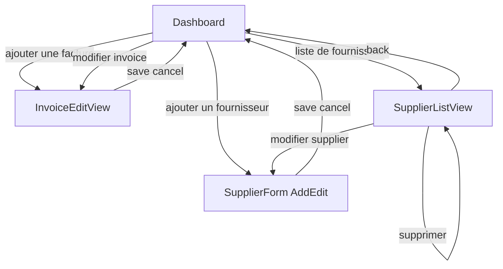
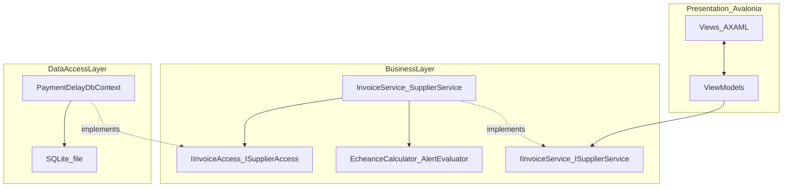
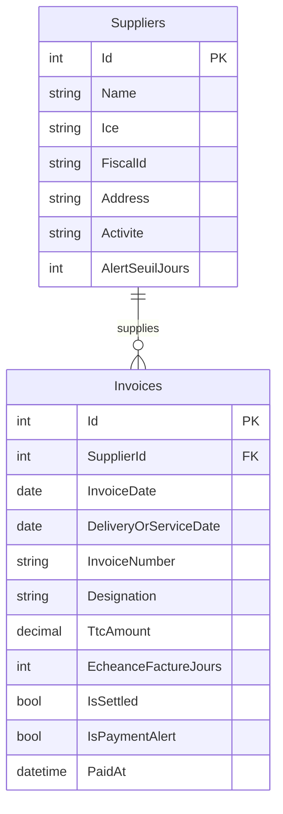
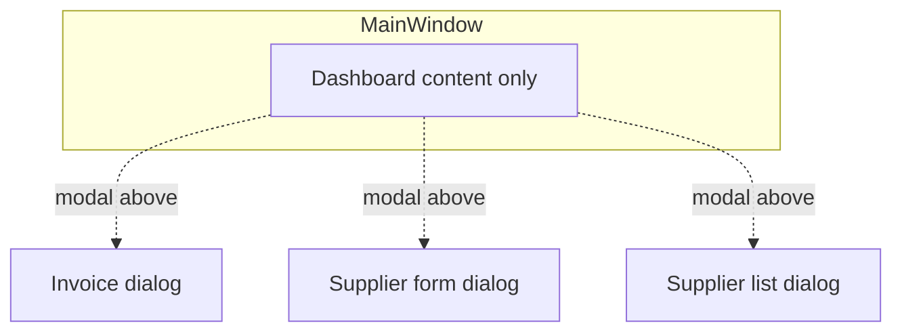

# Avalonia desktop app — invoice & supplier UI

> **Project copy:** `docs/avalonia_invoice_dashboard_plan.md` in **Payment Delay App**. Cursor may still keep a copy under `.cursor/plans/`.

## Goal

**.NET + Avalonia** desktop app: **MainWindow** = invoice **Dashboard** only; supplier form, supplier list (+ alerts), and invoice add/edit open as **modal dialogs** above it.

## Dashboard (invoices)

**Header**

- **parameters** — optional settings (v1 minimal) or jump to supplier list if you consolidate menus later.
- **Dashboard** — title.
- **recherche facture par** — filter grid.
- **ajouter un fournisseur** → **SupplierFormDialog** (Add mode), `Owner` = main window.
- **ajouter une facture** / **nouvelle facture** → **InvoiceEditDialog** (Add mode).
- **liste de fournisseur** → **SupplierListDialog** (liste + alerts).

**Invoice grid columns** (dark header row): Date de facture; Date de livraison ou prestation; N° de Facture; Fournisseur; Désignation; TTC; Date d'échéance normale; Date d'échéance_respectée; Reste des jours; Date d'échéance/facture.

**User-editable vs computed**

- Among the **échéance** block, **only** **Date d'échéance/facture** is **entered by the user** (see below). **Date d'échéance normale**, **Date d'échéance_respectée**, and **Reste des jours** are **read-only** and recalculated from **date de facture**, **today**, and that user value.

**Date d'échéance/facture (user input)**

- Stored as an **integer number of days** (payment term), **not** a free calendar date in v1.
- **Default: 60** jours.
- **Allowed range: 60–120** jours (validate on save; clamp or show error if out of range).
- UI: `NumericUpDown` / spinner / validated `TextBox` on invoice form; grid column shows the stored value (e.g. `60 j`).

**Computed column rules (authoritative)**

Let **D_F** = date de facture (date only), **D_T** = date aujourd’hui (evaluation date, typically today), **N** = user’s **Date d'échéance/facture** value in **days** (integer **60–120**, default **60**).

1. **Date d'échéance normale (jrs)** = **D_F − D_T** in **whole days** (*date de facture − date aujourd’hui*).
2. **Date d'échéance_respectée (jrs)** = **N** (the same **60–120** day term the user set for that invoice — the “délai à respecter” in days).
3. **Reste des jours** = **(Date d'échéance normale)** − **(Date d'échéance_respectée)** using the numeric **jrs** from (1) and (2).

**Optional display (read-only):** calendar **deadline** = **D_F + N days** can be shown as a tooltip or extra column for clarity; it is derived, not stored separately.

Recompute on load, after save, and when “today” crosses midnight if the app stays open (optional timer or refresh on focus).

**Alert popup (per-client threshold)** — if invoice is unpaid and **Reste des jours** < **`Supplier.AlertSeuilJours`**, show a **modal summary** listing clients that must proceed with payment (see supplier form for **AlertSeuilJours** field).

**Row actions**

- Three **icon** buttons (tooltips e.g. Edit, Delete, Modify) — wire to: open invoice **edit**, **delete invoice** (with confirm), and **modify** (same as full invoice edit or distinct command per your final UX).
- **Régler** — separate **button**; does **not** apply payment immediately. Opens the **confirmation dialog** below.

### Régler — dialog de confirmation (date et heure du règlement)

When the user clicks **Régler** on an invoice row, show a **modal dialog**:

- **Title** (example): *Confirmer le règlement*.
- **Short text**: ask the user to enter the **date and time** at which the payment should be recorded (e.g. *Entrez la date et l’heure auxquelles vous enregistrez le paiement*), with a note that the default is **now**.
- **Two inputs** (both default to **current date** and **current time** when the dialog opens):
  - **Date du règlement** — `DatePicker`, default = today.
  - **Heure du règlement** — time input (e.g. `TimePicker` or masked text), default = current time.
- **Buttons**: **Annuler** (close, no change) and **Confirmer le règlement** (apply).

**On Confirmer**: combine date + time into a single `DateTime`, persist as the invoice **payment/settlement timestamp** (e.g. `PaidAt` / `SettledAt`), set the invoice **settled/paid** flag, close the dialog, refresh the grid. The stored value is exactly what the user chose (not silently overwritten).

**Sketch**

```text
┌──────────────────────────────────────────────────────────────────┐
│  Confirmer le règlement                                           │
├──────────────────────────────────────────────────────────────────┤
│  Entrez la date et l’heure auxquelles vous enregistrez le         │
│  paiement (par défaut : maintenant).                             │
│                                                                   │
│  Date du règlement     [ DatePicker → default today ]            │
│  Heure du règlement    [ TimePicker / time field → default now ] │
│                                                                   │
├──────────────────────────────────────────────────────────────────┤
│                        [ Annuler ]  [ Confirmer le règlement ]   │
└──────────────────────────────────────────────────────────────────┘
```

**Implementation notes**: `RèglementDialogView` + VM, or `Window` / `ContentDialog` pattern; validate that time is present; optional max date rule if needed later.

## Supplier form — ajouter fournisseur page

Title **ajouter fournisseur page**, section **fournisseur info**: **name** (required), **ice**, **if**, **address**, **activité** (optional), **`AlertSeuilJours`** (seuil d’alerte paiement, jours; default e.g. **7**). **Enregistrer** / **Annuler** top-right. Same form reused for **Edit** when opened from supplier list **modifier**.

## Supplier list — liste de fournisseur + page d'alerte

One view (matches Excel vertical layout: **top** suppliers, **bottom** alerts).

**liste de fournisseur**

- `DataGrid`: **nome** (name), **ice**, **if**, **address**, **activite** (use mockup spelling for labels or normalize to French — your choice in implementation).
- Row actions: **modifier** → supplier form **Edit**; **supprimer** → confirm dialog, then remove. If any **Invoice** references that `SupplierId`, block delete or show message (prefer **block** with explanation in v1).

**page d'alerte** (subsection below the supplier grid)

- Second `DataGrid` or list: **date de facture**, **client name** (display **supplier / client** name — map to **Fournisseur** / supplier name on the invoice), **ttc gross amount**, **remaining time** (same semantics as **Reste des jours** / days until due, negative if overdue).
- **Data rule (v1)**: rows = invoices that are **not régler**/unpaid and (**overdue** OR **due within N days** — e.g. 7, configurable later). Reuse the same due-date logic as the dashboard. **Persistence:** you can load candidates with **`IsPaymentAlert = 1` (and unsettled)** from **`Invoices`** only; still **join or lookup** supplier **name** for display if it is not duplicated on the invoice row.

**ViewModel**: `SupplierListViewModel` with `ObservableCollection<SupplierRow>`, `ObservableCollection<AlertRow>` (projected from invoices + suppliers), commands **EditSupplier**, **DeleteSupplier**, **RefreshAlerts**.

## Invoice screen — page d'ajout/modif de facture

Title + **Enregistrer** / **Annuler**. Two-column label/input form:

- Date de facture, Date de livraison ou préstation, N° de Facture, **Fournisseur** (`ComboBox`), Désignation, TTC, **Date d'échéance/facture** (days **60–120**, default **60**). **Date d'échéance normale**, **Date d'échéance_respectée**, **Reste des jours**: **read-only**, same formulas as dashboard.

`InvoiceEditViewModel`: **Add** vs **Edit**.

## Navigation (summary)



## Architecture (3-tier + MVVM)

**Dependency rule:** **Presentation** depends on **`PaymentDelayApp.BusinessLayer`**; **BusinessLayer** defines **`IInvoiceService` / `ISupplierService`** (for **ViewModels** — inject interfaces so implementations can be swapped or **mocked** in tests) and **`IInvoiceAccess` / `ISupplierAccess`** (storage ports); **`PaymentDelayApp.DataAccessLayer`** implements the **Access** interfaces with **EF Core**. **ViewModels** never reference `DbContext` or concrete **`InvoiceService` / `SupplierService`** directly.



**No classic repository naming** — storage ports are **`IInvoiceAccess`**, **`ISupplierAccess`** (same stem as **`InvoiceAccess`**, **`SupplierAccess`** in **DataAccessLayer**). **Application services** expose **`IInvoiceService`**, **`ISupplierService`**; **`InvoiceService`**, **`SupplierService`** are the default implementations used by DI. **ViewModels** depend only on the **service** interfaces so you can substitute **mocks/fakes** later. **v1 has no test project**, but this shape avoids a big refactor when you add one.

**1. Data access layer** — **`PaymentDelayApp.DataAccessLayer`**

- **`PaymentDelayDbContext`**: `DbSet<Supplier>`, `DbSet<Invoice>`; **`OnModelCreating`** calls **`ModelConfiguration.Apply(modelBuilder)`** — one file **`ModelConfiguration.cs`** with **all** Fluent API for **Supplier** and **Invoice**.
- **Microsoft.EntityFrameworkCore.Sqlite**; DB file e.g. `%LocalAppData%/PaymentDelayApp/app.db` or beside the exe.
- **`InvoiceAccess` / `SupplierAccess`**: implement the interfaces using **`DbContext`** + `SaveChangesAsync` (or consolidate behind **`AppUnitOfWork`** later if needed).
- **Migrations:** `dotnet ef migrations add Initial` with startup project = Avalonia app, **`DbContext`** in **DataAccessLayer**.

**2. Business layer** — **`PaymentDelayApp.BusinessLayer`**

- **Abstractions/**: `IInvoiceService`, `ISupplierService` (orchestration for UI); `IInvoiceAccess`, `ISupplierAccess` (persistence).
- **Models/**, **Services/** (`InvoiceService`, `SupplierService` implement the **service** interfaces), **Calculators/**.

**3. Presentation** — **`PaymentDelayApp`**

- **DI:** register `DbContext`; **`IInvoiceAccess` → `InvoiceAccess`**, **`ISupplierAccess` → `SupplierAccess`**; **`IInvoiceService` → `InvoiceService`**, **`ISupplierService` → `SupplierService`**. Resolve **ViewModels** with **`IInvoiceService` / `ISupplierService`** (and UI services such as **`IDialogService`**) only.

**NuGet (UI):** **CommunityToolkit.Mvvm**.

## Database schema (EF Core + SQLite)

**Two tables:** `Suppliers`, `Invoices`. **Relationship:** each invoice belongs to **one** supplier; a supplier has **many** invoices. **FK:** `Invoices.SupplierId` → `Suppliers.Id` with **ON DELETE RESTRICT** (SQLite: no cascade delete — deleting a supplier with invoices must fail at the DB layer and in UI).

**Not stored in the database:** dashboard **échéance normale**, **échéance respectée**, and **Reste des jours** — computed in **BusinessLayer** from `InvoiceDate`, evaluation date (usually today), and `EcheanceFactureJours`.

**Stored denormalized flag (`Invoices`):** **`IsPaymentAlert`** (SQLite **INTEGER** 0/1, NOT NULL, default **0**). **1** when the invoice is in the **payment-alert** state: **not settled** and **Reste des jours** &lt; **`Supplier.AlertSeuilJours`** using the **same rules** as the popup / **page d’alerte**. This is **not** a second source of truth for the math — it is updated whenever the app evaluates alerts so you can query **alerted invoices from `Invoices` alone**, e.g. `WHERE IsPaymentAlert = 1 AND IsSettled = 0`, **without an inner join to `Suppliers`** just to read each row’s threshold. **Keep in sync:** set/clear on **invoice save**; **batch-refresh** all invoices for a supplier when **`AlertSeuilJours`** changes; clear on **Régler** (settled); run a **refresh pass on startup** and when the **dashboard loads** (or when the calendar day changes) so the flag does not stay wrong after **today** moves.



### Table `Suppliers` (SQLite)

| Column            | SQLite type | Constraints / notes                       |
| ----------------- | ----------- | ----------------------------------------- |
| `Id`              | INTEGER     | PK, `AUTOINCREMENT`                       |
| `Name`            | TEXT        | NOT NULL                                  |
| `Ice`             | TEXT        | NULL                                      |
| `FiscalId`        | TEXT        | NULL (IF — C# property e.g. `FiscalId`)   |
| `Address`         | TEXT        | NULL                                      |
| `Activite`        | TEXT        | NULL                                      |
| `AlertSeuilJours` | INTEGER     | NOT NULL, default **7**                   |

**EF / C#:** entity `Supplier`; table name `Suppliers` (plural) unless you override with `ToTable`.

### Table `Invoices` (SQLite)

| Column                  | SQLite type        | Constraints / notes                                                                 |
| ----------------------- | ------------------ | ----------------------------------------------------------------------------------- |
| `Id`                    | INTEGER            | PK, `AUTOINCREMENT`                                                                 |
| `SupplierId`            | INTEGER            | NOT NULL, FK → `Suppliers.Id`, **ON DELETE RESTRICT**                               |
| `InvoiceDate`           | TEXT (ISO date)    | NOT NULL — map as `DateOnly` / `DateTime` date part per EF SQLite conventions       |
| `DeliveryOrServiceDate` | TEXT (ISO date)    | NULL                                                                                |
| `InvoiceNumber`         | TEXT               | NOT NULL                                                                            |
| `Designation`           | TEXT               | NULL                                                                                |
| `TtcAmount`             | REAL               | NOT NULL — monetary; use `decimal` in C#                                            |
| `EcheanceFactureJours`  | INTEGER            | NOT NULL, default **60**; validate **60–120** in app before save                    |
| `IsSettled`             | INTEGER            | NOT NULL, default **0** (false)                                                     |
| `IsPaymentAlert`        | INTEGER            | NOT NULL, default **0** — denormalized; see note above                                |
| `PaidAt`                | TEXT (ISO DateTime)| NULL until **Régler** confirms; store offset or UTC consistently in one convention  |

**EF / C#:** entity `Invoice` with `bool IsPaymentAlert`; navigation `Supplier` optional; required FK `SupplierId`.

### Indexes (recommended)

| Name                      | Table     | Columns        | Purpose                          |
| ------------------------- | --------- | -------------- | -------------------------------- |
| `IX_Invoices_SupplierId`  | `Invoices`| `SupplierId`   | FK lookups, combo / list filters |
| `IX_Invoices_InvoiceDate` | `Invoices`| `InvoiceDate`  | Sorting, date-range queries      |
| `IX_Invoices_IsSettled`   | `Invoices`| `IsSettled`    | Unpaid lists                     |
| `IX_Invoices_IsPaymentAlert_IsSettled` | `Invoices` | `IsPaymentAlert`, `IsSettled` | Filter alerted unpaid rows without joining `Suppliers` |

**EF packages:** `Microsoft.EntityFrameworkCore.Sqlite`, `Microsoft.EntityFrameworkCore.Design` (tools), optional `Microsoft.EntityFrameworkCore.Tools` in UI project for PMC/cli migrations.

### Reference DDL (SQLite, illustrative)

Single-file schema for readability; **authoritative mapping** remains **`ModelConfiguration.cs`** + migrations.

```sql
CREATE TABLE Suppliers (
  Id INTEGER PRIMARY KEY AUTOINCREMENT NOT NULL,
  Name TEXT NOT NULL,
  Ice TEXT NULL,
  FiscalId TEXT NULL,
  Address TEXT NULL,
  Activite TEXT NULL,
  AlertSeuilJours INTEGER NOT NULL DEFAULT 7
);

CREATE TABLE Invoices (
  Id INTEGER PRIMARY KEY AUTOINCREMENT NOT NULL,
  SupplierId INTEGER NOT NULL,
  InvoiceDate TEXT NOT NULL,
  DeliveryOrServiceDate TEXT NULL,
  InvoiceNumber TEXT NOT NULL,
  Designation TEXT NULL,
  TtcAmount REAL NOT NULL,
  EcheanceFactureJours INTEGER NOT NULL DEFAULT 60,
  IsSettled INTEGER NOT NULL DEFAULT 0,
  IsPaymentAlert INTEGER NOT NULL DEFAULT 0,
  PaidAt TEXT NULL,
  FOREIGN KEY (SupplierId) REFERENCES Suppliers (Id) ON DELETE RESTRICT
);

CREATE INDEX IX_Invoices_SupplierId ON Invoices (SupplierId);
CREATE INDEX IX_Invoices_InvoiceDate ON Invoices (InvoiceDate);
CREATE INDEX IX_Invoices_IsSettled ON Invoices (IsSettled);
CREATE INDEX IX_Invoices_IsPaymentAlert_IsSettled ON Invoices (IsPaymentAlert, IsSettled);
```

## Project structure

**Solution** `PaymentDelayApp.sln` — **net8.0** (or **net9.0**).

### Folder tree (recommended)

```text
PaymentDelayApp/                          # Avalonia executable
  App.axaml
  App.axaml.cs
  Program.cs
  Views/
    MainWindow.axaml
    DashboardView.axaml                     # or embed in MainWindow
    Dialogs/
      InvoiceEditWindow.axaml
      SupplierFormWindow.axaml
      SupplierListWindow.axaml
      ReglementConfirmWindow.axaml
      PaymentAlertWindow.axaml
  ViewModels/
    MainWindowViewModel.cs
    DashboardViewModel.cs
    InvoiceEditViewModel.cs
    SupplierFormViewModel.cs
    SupplierListViewModel.cs
    ReglementDialogViewModel.cs
    PaymentAlertViewModel.cs
  Services/                                 # UI-only: IDialogService, navigation
    DialogService.cs
  Converters/                               # optional value converters
  Assets/

PaymentDelayApp.BusinessLayer/
  Abstractions/
    IInvoiceService.cs
    ISupplierService.cs
    IInvoiceAccess.cs
    ISupplierAccess.cs
  Models/
    Invoice.cs
    Supplier.cs
  Services/
    InvoiceService.cs
    SupplierService.cs
  Calculators/
    EcheanceCalculator.cs
    PaymentAlertEvaluator.cs
  Validation/                               # optional

PaymentDelayApp.DataAccessLayer/
  PaymentDelayDbContext.cs
  ModelConfiguration.cs              # single file: all EF mapping for Supplier + Invoice
  Access/
    InvoiceAccess.cs
    SupplierAccess.cs
  Migrations/
```

**References:** `PaymentDelayApp` → `BusinessLayer`, `DataAccessLayer`; `DataAccessLayer` → `BusinessLayer` + EF Core Sqlite packages.

**Note:** Optional later: `PaymentDelayApp.Abstractions` if **DataAccessLayer** must not reference **BusinessLayer** models.

## NuGet

- **UI:** `Avalonia`, `Avalonia.Desktop`, `Avalonia.Controls.DataGrid` (or compatible), `CommunityToolkit.Mvvm`, `Microsoft.Extensions.DependencyInjection`.
- **DataAccessLayer:** `Microsoft.EntityFrameworkCore.Sqlite`, `Microsoft.EntityFrameworkCore.Design`.

## Verification

- **MainWindow** stays on Dashboard; supplier/invoice/list flows open **modal dialogs** above it. Dashboard search + invoice CRUD; **Régler** opens payment dialog (date+time, default now).
- Add supplier via dialog; appears in **liste de fournisseur** and in invoice **Fournisseur** combo.
- Supplier **modifier** / **supprimer** (with reference guard).
- **page d'alerte** and **Reste** align with **BusinessLayer** calculators; **EF** persists suppliers/invoices; migrations apply on first run or via deploy step.


